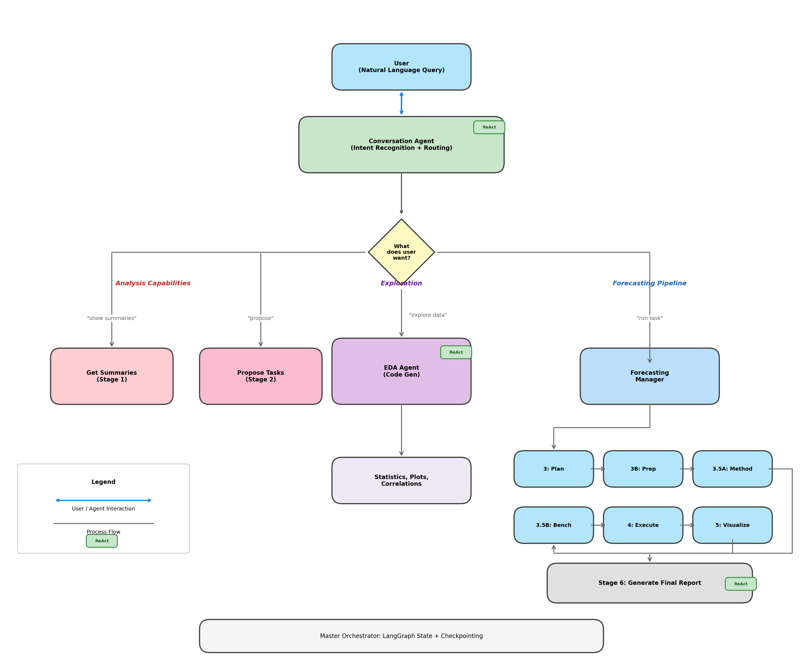

<div align="center">

# 🤖 Agentic AI Data Science Pipeline
### *Automated End-to-End Data Science with Multi-Agent Orchestration*

[](https://www.python.org/downloads/)
[](https://www.langchain.com/langgraph)
[](https://fastapi.tiangolo.com/)
[](unavailable)

<br/>

**A production-ready system that automates workflows from data ingestion to report generation using ReAct agents and Large Language Models.**



</div>

---

## 📖 Table of Contents

- [Key Features](#-key-features)
- [Pipeline Architecture](#-pipeline-architecture)
- [Quick Start](#-quick-start)
- [Project Structure](#-project-structure)
- [Tech Stack](#-tech-stack)
- [Chat Interface Guide](#-using-the-chat-interface)
- [Configuration](#-configuration-reference)
- [API Endpoints](#-api-endpoints)

---

## ✨ Key Features

| Feature | Description |
|:---:|---|
| **🎯 Multi-Agent Orchestration** | **9 specialized agents** coordinate via a master orchestrator to solve complex tasks. |
| **🧠 ReAct Framework** | Agents use **Reason + Act** loops to iteratively solve problems using 15+ custom tools. |
| **💬 Conversational Interface** | Natural language task specification ("Predict sales next month") with follow-up capabilities. |
| **📊 End-to-End Automation** | Handles everything: **EDA → Planning → Feature Eng → Benchmark → Execution → Reporting**. |
| **🔄 Dynamic Method Selection** | Automatically benchmarks multiple ML methods (XGBoost, LightGBM, etc.) and picks the winner. |
| **🛡️ Guardrails Validation** | Optional safety layer for model validation and fairness analysis. |
| **🌐 Web UI** | Real-time **status tracking**, markdown chat, logs viewer, and artifact browser. |

---

## 🏗️ Pipeline Architecture

The system uses a sequential yet flexible pipeline of agents.

```mermaid
graph LR
    S1[Stage 1<br/>Data Analysis] --> S2[Stage 2<br/>Task Proposals]
    S2 --> S3[Stage 3<br/>Execution Planning]
    S3 --> S3B[Stage 3B<br/>Data Preparation]
    S3B --> S35A[Stage 3.5A<br/>Method Proposals]
    S35A --> S35B[Stage 3.5B<br/>Benchmarking]
    S35B --> S4[Stage 4<br/>Execution]
    S4 --> S5[Stage 5<br/>Visualization]
    S5 --> S6[Stage 6<br/>Report Generation]
    S6 -.-> S7[Stage 7<br/>Guardrails]
    
    style S1 fill:#e1f5fe,stroke:#01579b
    style S4 fill:#e0f2f1,stroke:#00695c
    style S6 fill:#f3e5f5,stroke:#7b1fa2
```



<details>
<summary><b>🔍 Click to view detailed stage descriptions</b></summary>

| Stage | Description |
|-------|-------------|
| **Stage 1** | Analyzes datasets, generates structured summaries with statistical profiles |
| **Stage 2** | Proposes ML tasks based on data characteristics and user intent |
| **Stage 3** | Creates detailed execution plans with feature engineering strategies |
| **Stage 3B** | Prepares and transforms data according to the plan |
| **Stage 3.5A** | Proposes multiple ML methods suitable for the task |
| **Stage 3.5B** | Benchmarks methods with cross-validation, selects winner |
| **Stage 4** | Executes the winning method, generates predictions |
| **Stage 5** | Creates visualizations (actual vs predicted, residuals, etc.) |
| **Stage 6** | Generates comprehensive markdown reports |
| **Stage 7** | *(Optional)* Guardrails validation and fairness analysis |

</details>

---

## 🚀 Quick Start

> [!IMPORTANT]
> Make sure you have **Python 3.10+** installed and an LLM backend ready (Local or Groq).

### 1. Installation

```bash
# Clone the repository
git clone <repo-url>
cd final_code

# Create virtual environment
python -m venv venv
source venv/bin/activate  # Linux/Mac
# or: venv\Scripts\activate  # Windows

# Install dependencies
pip install -r requirements.txt
```

### 2. Configuration

Set up your environment variables for the LLM backend.

> [!TIP]
> Using **Groq** puts the pipeline on turbo mode for faster inference.

```bash
# Option 1: Local LLM (vLLM, Ollama, etc.)
export LLM_BASE_URL="http://localhost:8001/v1"
export LLM_API_KEY="EMPTY"

# Option 2: Groq Cloud API
export USE_GROQ="true"
export GROQ_API_KEY="your-groq-api-key"
```

### 3. Running the Application

**Option 1: Main Server (Recommended)**
```bash
cd conversational
python server.py
```
> Server runs on: **http://localhost:8000**

**Option 2: UI API Server (Alternative)**
```bash
python ui/api.py
```
> Server runs on: **http://localhost:8008**

---

## 📁 Project Structure

```
final_code/
├── README.md                     # 📌 You are here
├── docs/                         # Documentation assets
├── conversational/               # 🧠 Main Intelligence Core
│   ├── code/                     # Agent logic & Orchestrator
│   ├── tools/                    # 15+ specialized tools
│   ├── ui/                       # Web Interface
│   ├── server.py                 # Main Entry Point
│   ├── data/                     # Dataset storage
│   └── output/                   # 📄 Generated Reports & Models
└── dump/                         # Experimental / Legacy code
```

---

## 🛠️ Tech Stack

<div align="center">

| Category | Technologies |
|----------|--------------|
| **🧠 AI Core** | LangChain, LangGraph, OpenAI API |
| **🤖 LLMs** | Qwen, GPT-4, Llama-3 (Groq), vLLM |
| **🔬 Data Science** | Pandas, NumPy, Scikit-learn, XGBoost, LightGBM |
| **📈 Viz** | Matplotlib, Seaborn, Plotly |
| **⚡ Backend** | FastAPI, Uvicorn, WebSockets |
| **💾 Data** | Parquet, JSON, CSV |

</div>

---

## 💬 Using the Chat Interface

The system is designed to be conversational. Here's a typical workflow:

1.  **Start a Task** 🟢
    > "Predict insurance charges based on the available features."

2.  **Follow Progress** 🔵
    > Watch the real-time sidebar updates as agents plan, execute, and verify.

3.  **Deep Dive** 🟣
    > "What is the R² score of the best model?"
    > "Show me the top 5 most important features."

4.  **EDA & Analysis** 🟠
    > "Show distribution of age in the heart dataset."

---

## 🔧 Configuration Reference

Edit `conversational/code/config.py` to customize the pipeline.

| Setting | Description | Default |
|:---|:---|:---|
| `LLM_BASE_URL` | LLM server endpoint | `http://localhost:8001/v1` |
| `USE_GROQ` | Enable Groq cloud | `false` |
| `STAGE_MAX_ROUNDS` | Max iterations per stage | Varies (15-120) |
| `RECURSION_LIMIT` | LangGraph recursion cap | `200` |
| `BENCHMARK_ITERATIONS` | Cross-validation folds | `3` |

---

## 📊 API Endpoints

| Endpoint | Method | Description |
|---|---|---|
| `/` | `GET` | Main Chat Interface |
| `/logs` | `GET` | Live Pipeline Logs |
| `/outputs` | `GET` | Artifact Browser |
| `/status` | `GET` | Task Status Monitor |
| `/api/chat/send` | `POST` | Send Chat Message |
| `/ws/task-progress` | `WS` | Real-time Status Stream |

---

<p align="center">
  <i>Built with ❤️ using LangGraph 🦜⛓️ and FastAPI ⚡</i>
</p>
