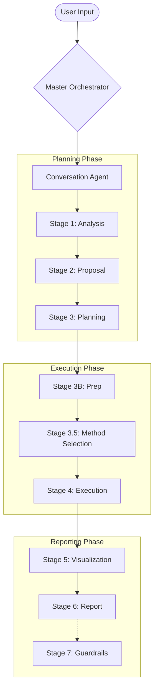

# Conversational AI Pipeline

**The Intelligent Core of the System**

The **Conversational Module** is the brain of the operation, containing all agent logic, tool definitions, and data processing capabilities.

---

## Directory Structure

| Directory | Purpose |
|---|---|
| **`code/`** | **Core Logic**: Agent implementations and orchestration logic |
| **`tools/`** | **Capabilities**: Tool definitions for each stage |
| **`ui/`** | **Interface**: Web interface and API server |
| **`data/`** | **Storage**: Sample datasets and storage |
| **`output/`** | **Artifacts**: Generated reports and models |

---

## Getting Started

> [!TIP]
> This is the recommended way to start the entire system.

```bash
# From the conversational directory
python server.py
```

Runs on: **http://localhost:8000**

**Alternative Port (8008):**
```bash
python ui/api.py
```

---

## Data Flow

The data flows sequentially through the pipeline, coordinated by the **Master Orchestrator**.



---

## Configuration

All settings are centralized in `code/config.py`.

> [!NOTE]
> See the main [README](../README.md) for full configuration options including LLM endpoints and Groq setup.
