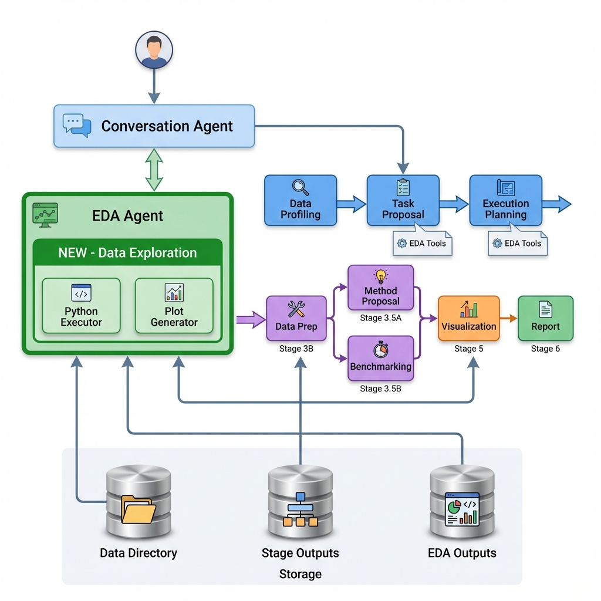
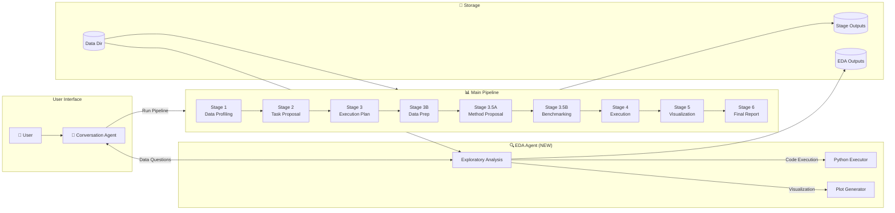
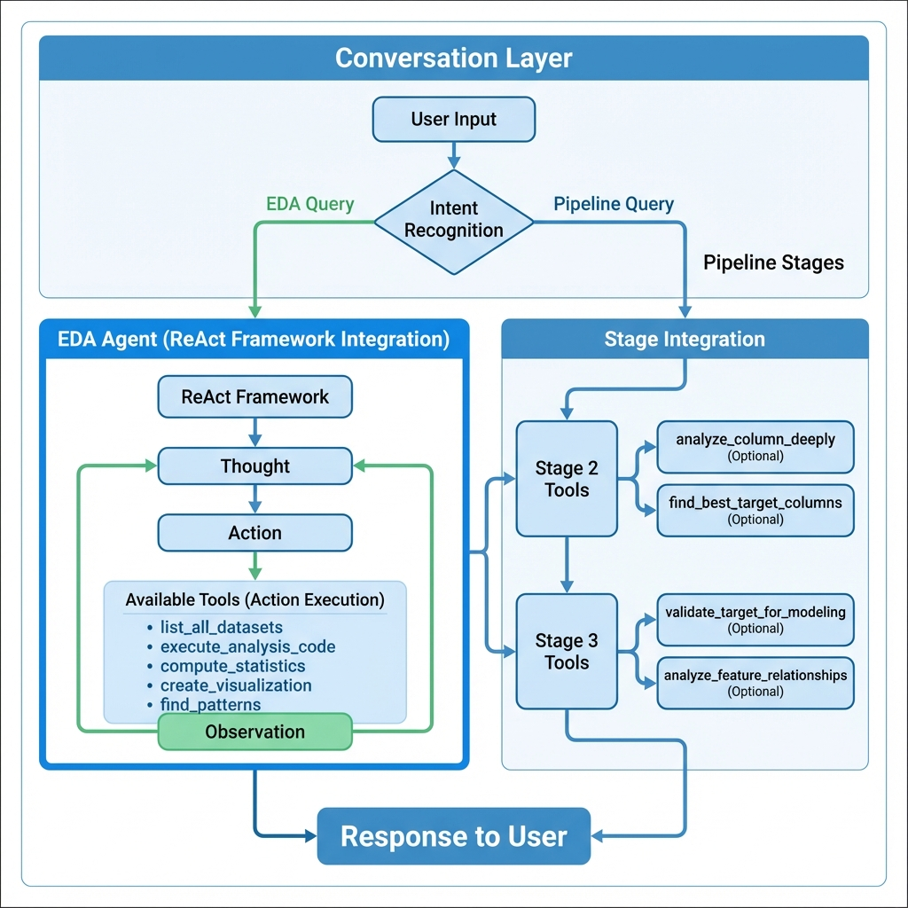
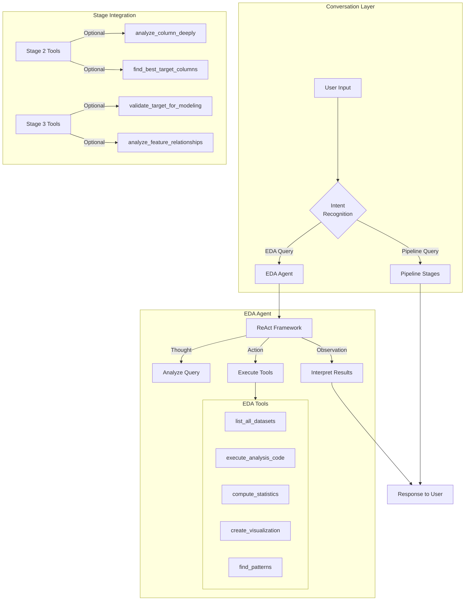
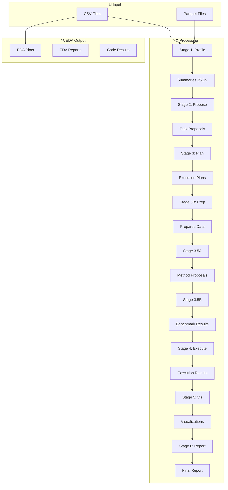

# Conversational AI Pipeline - Progress Report

**Last Updated:** December 16, 2025

---

## Pipeline Architecture

### Main Pipeline Flow



<details>
<summary>View Mermaid Source</summary>


</details>

---

### EDA Integration Detail



<details>
<summary>View Mermaid Source</summary>


</details>

---

### Data Flow Architecture



---

## Overview

This is a **conversational AI-powered data analysis and forecasting pipeline** that enables users to:
- Analyze datasets through natural language conversation
- Automatically generate task proposals for forecasting and analysis
- Execute machine learning pipelines with automated method selection
- Generate visualizations and reports

---

## Implemented Components

### Core Infrastructure

| Component | Status | Description |
|-----------|--------|-------------|
| `config.py` | ✅ Complete | Centralized configuration for LLM settings, directories, and data handling |
| `models.py` | ✅ Complete | Pydantic models for all pipeline stages |
| `utils.py` | ✅ Complete | Utility functions for data loading, profiling, and execution |
| `master_orchestrator.py` | ✅ Complete | Pipeline coordination and conversational interface |

---

### Pipeline Stages

| Stage | File | Status | Description |
|-------|------|--------|-------------|
| **Stage 1** | `stage1_agent.py` | ✅ Complete | Data Profiling - Summarizes all datasets |
| **Stage 2** | `stage2_agent.py` | ✅ Complete | Task Proposal - Generates analytical task proposals |
| **Stage 3** | `stage3_agent.py` | ✅ Complete | Execution Planning - Creates detailed execution plans |
| **Stage 3B** | `stage3b_agent.py` | ✅ Complete | Data Preparation - Prepares data for modeling |
| **Stage 3.5A** | `stage3_5a_agent.py` | ✅ Complete | Method Proposal - Proposes 3 best algorithms |
| **Stage 3.5B** | `stage3_5b_agent.py` | ✅ Complete | Benchmarking - Tests methods and selects best |
| **Stage 4** | `stage4_agent.py` | ✅ Complete | Execution - Runs the winning method |
| **Stage 5** | `stage5_agent.py` | ✅ Complete | Visualization - Creates plots and insights |
| **Stage 6** | `stage6_agent.py` | ✅ Complete | Final Report - Generates comprehensive report |

---

### Conversational Interface

| Component | Status | Description |
|-----------|--------|-------------|
| `conversation_agent.py` | ✅ Complete | Handles user messages and intent detection |
| `conversation_tools.py` | ✅ Complete | Tools for data queries, task creation, pipeline control |
| `run_conversational.py` | ✅ Complete | Main entry point with multiple modes |

---

### EDA Agent (NEW)

| Component | Status | Description |
|-----------|--------|-------------|
| `eda_agent.py` | ✅ Complete | Standalone EDA agent with ReAct framework |
| `eda_tools.py` | ✅ Complete | 11 tools for data exploration and analysis |

**EDA Features:**
- ✅ Writes its own Python code for custom analysis (no hardcoded code!)
- ✅ Creates visualizations on demand
- ✅ Computes statistics, correlations, finds patterns
- ✅ Detects new datasets and asks user before summarizing
- ✅ Integrated into Stage 2 and Stage 3 as optional tools

**EDA Tools:**
| Tool | Purpose |
|------|---------|
| `list_all_datasets` | List all available datasets with status |
| `get_dataset_info` | Get detailed dataset information |
| `check_for_new_datasets` | Find unsummarized datasets |
| `execute_analysis_code` | Run custom Python code |
| `compute_statistics` | Compute descriptive statistics |
| `compute_correlation` | Compute correlation matrices |
| `find_patterns` | Analyze patterns in columns |
| `compare_datasets` | Compare two datasets |
| `create_visualization` | Create plots (bar, line, scatter, etc.) |
| `save_eda_report` | Save analysis as report |
| `summarize_new_dataset` | Profile new datasets |

---

### Stage-Integrated EDA Tools

**Stage 2 (Task Proposal):**
| Tool | Purpose |
|------|---------|
| `analyze_column_deeply` | Deep-dive into a column before proposing it as target |
| `find_best_target_columns` | Rank columns by suitability as prediction targets |
| `explore_data_with_code` | Run custom analysis code |

**Stage 3 (Execution Planning):**
| Tool | Purpose |
|------|---------|
| `validate_target_for_modeling` | Validate target column before finalizing plan |
| `analyze_feature_target_relationships` | Check feature-target correlations |

---

## Directory Structure

```
conversational/
├── code/                      # Core Python code
│   ├── config.py              # Configuration
│   ├── models.py              # Pydantic models
│   ├── utils.py               # Utility functions
│   ├── master_orchestrator.py # Pipeline orchestration
│   ├── conversation_agent.py  # Conversational AI
│   ├── eda_agent.py           # EDA Agent (NEW)
│   ├── stage1_agent.py        # Stage 1: Data Profiling
│   ├── stage2_agent.py        # Stage 2: Task Proposal
│   ├── stage3_agent.py        # Stage 3: Execution Planning
│   ├── stage3b_agent.py       # Stage 3B: Data Preparation
│   ├── stage3_5a_agent.py     # Stage 3.5A: Method Proposal
│   ├── stage3_5b_agent.py     # Stage 3.5B: Benchmarking
│   ├── stage4_agent.py        # Stage 4: Execution
│   ├── stage5_agent.py        # Stage 5: Visualization
│   └── stage6_agent.py        # Stage 6: Final Report
├── tools/                     # LangChain tools for each stage
│   ├── conversation_tools.py  # Conversation tools
│   ├── eda_tools.py           # EDA tools (NEW)
│   ├── stage1_tools.py        # Data profiling tools
│   ├── stage2_tools.py        # Task proposal tools
│   ├── stage3_tools.py        # Execution planning tools
│   ├── stage3b_tools.py       # Data preparation tools
│   ├── stage3_5a_tools.py     # Method proposal tools
│   ├── stage3_5b_tools.py     # Benchmarking tools
│   ├── stage4_tools.py        # Execution tools
│   ├── stage5_tools.py        # Visualization tools
│   └── stage6_tools.py        # Report generation tools
├── data/                      # Input data files (CSV, etc.)
├── output/                    # Pipeline outputs
│   ├── summaries/             # Stage 1 dataset summaries
│   ├── stage2_out/            # Task proposals
│   ├── stage3_out/            # Execution plans
│   ├── stage3b_data_prep/     # Prepared data
│   ├── stage3_5a_out/         # Method proposals
│   ├── stage3_5b_out/         # Benchmarking results
│   ├── stage4_out/            # Execution results
│   ├── stage5_out/            # Visualizations
│   ├── stage6_out/            # Final reports
│   ├── eda_out/               # EDA outputs (NEW)
│   └── eda_workspace/         # EDA working directory (NEW)
├── progress_reports/          # This documentation
└── run_conversational.py      # Main entry point
```

---

## Usage

### Interactive Mode
```bash
cd /scratch/ziv_baretto/llmserve/final_code/conversational
micromamba activate llm
python run_conversational.py
```

### Available Commands
- **EDA Queries:** "What columns are in X?", "Show correlations", "Create histogram"
- **Pipeline Commands:** "run task TSK-001", "show results", "status"
- **Data Queries:** "What data is available?", "Show summaries"

### Modes
```bash
python run_conversational.py                      # Interactive
python run_conversational.py --mode analyze       # Run Stage 1
python run_conversational.py --mode propose       # Run Stage 2
python run_conversational.py --mode run --task TSK-001  # Run pipeline
python run_conversational.py --status             # Check status
```

---

## Key Features

### 1. Dataset-Agnostic
- Works with any CSV/Parquet data
- Automatically profiles and understands data structure
- Proposes relevant analytical tasks

### 2. Conversational Interface
- Natural language queries
- Intent detection and routing
- Session persistence

### 3. Automated Method Selection
- Proposes multiple algorithms
- Benchmarks and selects best performer
- No manual ML configuration needed

### 4. EDA Agent
- Intelligent data exploration
- Custom code execution
- Visualization generation
- New dataset detection

### 5. ReAct Framework
- All agents use THOUGHT → ACTION → OBSERVATION
- Better reasoning and decision-making
- Self-correcting behavior

---

## Recent Updates (December 2025)

1. **EDA Agent Implementation**
   - Created standalone EDA agent with 11 tools
   - Agent writes its own Python code (no hardcoding)
   - Integrated into conversation flow

2. **Stage 2/3 EDA Integration**
   - Added optional EDA tools to Stage 2 for better task proposals
   - Added optional EDA tools to Stage 3 for better planning
   - Tools don't break existing pipeline flow

3. **New Dataset Detection**
   - EDA agent detects unsummarized datasets
   - Asks user for permission before summarizing

---

## LLM Configuration

- **Primary LLM:** Used for main agents
- **Secondary LLM:** Used for tool-based stages
- **EDA LLM:** Configured with higher token limit (8192) for code generation
- **Base URL:** Configurable (local or remote API)

---

## Next Steps / Future Work

- [ ] Add more visualization types
- [ ] Implement caching for EDA results
- [ ] Add support for more data formats (Excel, JSON, SQL)
- [ ] Improve error recovery in pipeline stages
- [ ] Add unit tests for all components
